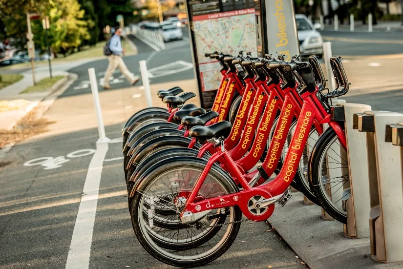

# README

This Introduction to Data Science final project aims to build a predictive model of bike activity at DC's Capital Bikeshare program.

Capital Bikeshare is a vital component of the transit system in Washington, D.C., however it has a recurring "rebalancing" issue. Our project aims to solve this problem by building a Capital Bikeshare predictive model. The project uses historical capital bikeshare trip data from 2022 to 2025 with weather data from National Oceanic and Atmospheric Administration (NOAA). We analyzed Net Daily Activity, the total number of arrivals per day minus total departures at a given station.

Our model attempts to predict net activity at the New Hampshire Ave/T Street bike station, [chosen because](https://github.com/sys9317/Final_Project/blob/main/final_paper.md#qmd2-summary_statisticsr) it had the second highest aggregate activity levels out of all stations, and a high negative net rating. Our main dataset comes from Capital Bike themselves, which publishes every month their ridership activity onto csv files. Each dataset contains observations at the individual ride level, showing where a given ride starts, ends, and some additional details on their membership or what kind of bike they used.

We decided to build our predictive model around the net activity of the New Hampshire Ave/T Street bike station. We used a [random forest model](https://github.com/sys9317/Final_Project/blob/main/final_paper.md#qmd4-model_makingqmd) that predicted station activity for November 2025, with an RMSE of 7.9 and 7.6 after adjustments were made. [Despite many attempts](https://github.com/sys9317/Final_Project/blob/main/final_paper.md#evaluating-our-model-and-solution), we failed to improve the model's predicting ability any further. We concluded a major source of error is the fact that Capital Bike moves bikes from one station to another to refill stations, something we were unable to account for. 

In the future, we'd like to explore this model again with a different data source, coming from Capital Bike's station API data. More can be read on the concept [here](https://github.com/sys9317/Final_Project/blob/main/final_paper.md#what-could-go-right).

[See our final paper](https://github.com/sys9317/Final_Project/blob/main/final_paper.md#final_project) discussing the project in further detail.

Links to QMD files used:
* [Organizing the Data from Capital Bike](https://github.com/sys9317/Final_Project/blob/main/reorg_cap_data_test.qmd)
* [Picking a Station to Model](https://github.com/sys9317/Final_Project/blob/main/summary_statistics.R)
* [Cleaning Dataset before Modeling](https://github.com/sys9317/Final_Project/blob/main/finalproject_cleaning.qmd)
* [Building the Predicitve Model](https://github.com/sys9317/Final_Project/blob/main/model_making.qmd)

[See our Bibliography](bibliography.md)
