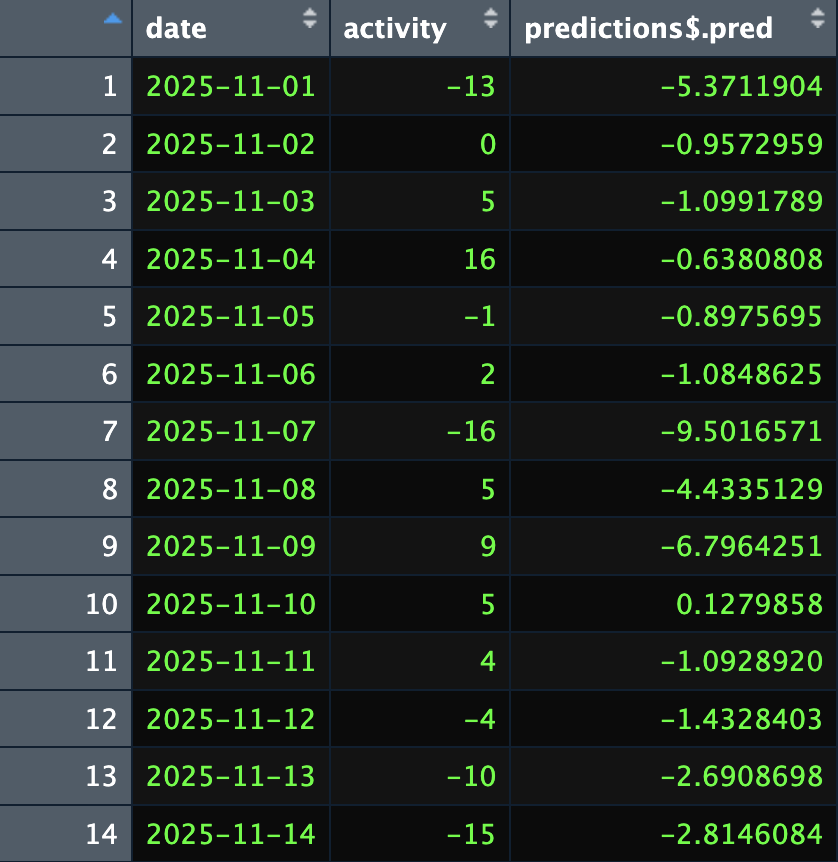

# Final_Project

## Introduction - Story and Thought Process

Capital Bikeshare is a vital component of the transit system in Washington, D.C., however it has a recurring "rebalancing" issue. We've all witnessed it: downtown docks overflow, making it impossible for riders to park, and bike docs in residential areas lie empty by 10:00 AM as commuters rush downtown. We believe that this imbalance generates unmet-demand - users who want to ride but can't find a bike, or want to park but can't find a dock. Even though Capital Bikeshare uses their vans to manually move and relocate bikes, users do not have data on their schedules or specific refill times. Therefore, our project aims to solve this problem by building a Capital Bikeshare predictive model. The project uses historical capital bikeshare trip data from 2022 to 2025 with weather data from National Oceanic and Atmospheric Administration (NOAA). Ultimately, this model could help predicting which station would need more refills or  preemptively deploy vans to the right stations before the imbalance occurs.

For this analysis, our main statistic was Net Daily Activity, which is the total number of arrivals per day minus total departures at a given station. We selected this over simple "Departures" or "Arrivals" to account for the specific limitations of our data:
1) Overcoming the "Unobservable" Van refill Problem: Although we are aware that rebalancing vans transport bicycles between stations, the dataset does not show us when this occurs. Regardless of whether the supply was intentionally or naturally replenished, we can measure the net volume of activity at a station to determine the overall activities that were applied.
2) Capturing Station "Popularity": Determining what constitutes a "popular" station is our aim. The intricacy of mixed-use stations is overlooked when just one-way trips (commutes) are tracked. We can discover high-traffic hubs that act as both sources and destinations throughout the day thanks to net activity.

Although we are aware that Capital Bikeshare uses vans to relocate bikes from one station to other stations in order to meet unmet demand, the open-data that has been used for this project do not contain this operational data. As a result, our dataset contains an "unobservable" factor.

This has two important effects on our metric: 

1) Natural vs. Artificial Supply: We are unable to determine whether a dock was made available by a van manually replenishing it or by a rider returning a bike. As a result, rather than measuring only natural demand, our metric measures serviced demand.
Thus, we must make assumptions whether some bike stations are always full at the beginning of the day or not, and has that been considered into the data.

2) Inflation of Popularity: A station may seem to have high "Net Activity" just because vehicles regularly replenish it to accommodate high turnover. This suggests that the stations in our model that are "most popular" could be the stations that actually have popular use from users or  getting the most van support from Capital Bikeshare.

### Choosing a Station

We decided to build our predictive model around the net activity of the New Hampshire Ave/T Street bike station. We chose this one because it had the second highest aggregate activity levels out of all stations, and a high negative net rating of -16, meaning on average there are 16 less bikes to end the day than to start. Given its proximity to Dupont Circle, U Street, and Adams Morgan, this seemed like a perfect station to analyze and try to predict.

## Our Data

Our main dataset comes from Capital Bike themselves, which publishes every month their ridership activity onto csv files. Each dataset contains observations at the individual ride level, showing where a given ride starts, ends, and some additional details on their membership or what kind of bike they used. For the sake of our project, all we care about is where a given ride started and ended. Also, we needed the data to be transformed so each observation is a day, with variables for every station showing how many rides started and ended on each station each day. 

We also included weather data in DC from the National Oceanic and Atmospheric Administration, an online database of weather stations across the country. We understood that a big factor in whether someone chooses to ride a bike or not is the weather, such as if it’s too cold or rainy vs a calm sunny day. Through NOAA, we were able to find recorded weather in DC for our entire timeframe, with details from min/max temperatures, humidity, snow or rain levels, and even wind strength.

## Implementation

### QMD #1: reorg_cap_data_test.qmd

In this QMD, we start by downloading the monthly Capital Bikeshare CSVs from
January 2022-November 2025, which total 47 CSVs. We then create a function that 
narrows down the variables to just the ones relevant to our project (i.e. 
started_at, start_station_name, start_station_id, end_station_name, 
end_station_id) and get rid of bikes that depart or arrive at non-stations, 
meaning those that were not parked at a station. We apply that function to all
47 CSVs.

We then create a function that splits the data into two: first, the station 
where bikes started their routes and second, the station where bikes ended their 
routes. This allows us to know, for any given station, how many rides started 
vs. ended there. We then reshape each half of the data so there is one row per 
day, and there is a column with the number of bikes that started or ended at 
that station (depending on which half of the data it is). We then merge the two
halves of the data back together, but we add the number of bikes that started at
a given station with the number of bikes that ended at that same station in a 
"merged counts"variable. It then calculates a "net activity" count by doing 
"bike ends - bike starts." This means that if more bikes start (or depart) from
a station than end (or arrive) at a station, net activity will be negative. Net
positive would mean that more bikes arrived at a station than departed. We did
it this way so that a negative net number would indicate the potential need for
vans to refill a given station. 

After running that function on all 47 CSVs, we then combine the rows from
all 47 CSVs into one file so that we have all of the data, from January 2022 to
November 2025, in one dataset. In cases where the CSVs repeat days, we remove 
that and tally their totals. We then save our updated dataset as a new CSV: 
net_daily_bike_usage_22_25.csv.

We then call on that new dataset and read in two weather CSVs that have weather
predictions for our entire time frame. There are two weather CSVs because we
were unable to download predictions for our entire timeframe in one go, so we 
downloaded them separately and merged them. We then merge our weather dataset 
with our original dataset and save it as: 
"net_daily_bike_usage_22_25_weather.csv"

### QMD#2: summary stats.qmd

In this QMD, we process daily bike usage data, which has been merged with 
weather information, in order to analyze the capital bike ride activity 
patterns at the individual station level. 
We start by making the date column of our dataset function as a date instead 
of a string of characters. We then make all of our station variables numeric. 
Next, we reshape our data from a wide format, where each station is a column, 
into a long format so we can look at activity by station. We calculate each 
station's total rides, average rides, and days with usage. Rides include bikes 
leaving from a station and bikes arriving at a station.

To identify the most active or popular stations, we sort by the highest amount 
of activity. We then compute the total rides per day for each station.
In the end, there will be three main sources of overall bike station usage. 
total_rides: sum of all rides for each station
mean_daily_rides: Average rides per day for each station
station_daily_summary
mean, median, standard deviation of ride activities for each station
Late, top_10_stations displays the 10 busiest/most used stations by total volume. 

### QMD#3: finalproject_cleaning.qmd
After reading in the CSV we created in the reorg_cap_data_test.qmd and
downloading the necessary libraries, we begin our setup for the model. Our first
step is lagging the data by 3 weeks. This means that the data in the columns
for each station will represent the data from 3 weeks earlier. For example, 
in the row for 1-22-2022, the numbers in each station column actually depict 
ridership from 1-1-2022. The purpose of this is to create a "recency" X 
variable. Meaning, in the same way that, in predicting ridership (our Y 
variable) our model will consider weather and whether it's a holiday, another 
consideration will be what ridership has looked like recently. To concretize 
recency, we chose to focus on the data from 3 weeks ago.

To set the data up to lag by 3 weeks, we select the columns representing the 
different stations, we create a "ridership" variable that hones in our station 
of choice, the Capital Bikeshare station at New Hampshire & T Street. That means
that the only station we will be predicting data for is the New Hampshire & T 
Street station. We then reset our data to include the date, ridership variable, 
and the data for all stations. We then create another dataset, data_lead, that 
conducts the 3 week lag. To do so, we use the mutate function to tell R to 
create a "lead" of 21 days. This makes the data in the station columns for 
1-22-2022 actually represent the data from 3 weeks earlier, on 1-1-2022. We then
save our dataset as "lead_data.CSV."

Note: We chose a 3 week lag, but we could have chosen 2 weeks ago, 1 week ago, 
etc. We tested out the model with a 21, 14, 10, and 2-day lag, and ultimately 
got very comparable results, so we went wth 21 days, or 3 weeks.

We then merged our weather data onto our lead_data.CSV on the variable date and
saved this CSV as "lead_data_weather.CSV." Then, using this updated CSV, we 
force the date to be a proper date type so it is identifiably a date and not a
set of characters, for example. We then hone in on all columns besides for
ridership.

Then, we create a recipe using all variables (which we just set to be all 
variables besides ridership) that creates a new column for each of the following
holidays: Labor Day, New Years Day, Christmas Day, Easter, Good Friday, US 
Independence Day, US Memorial Day, US Thanksgiving Day, US Veterans Day, and US 
MLK's Birthday. Each column is set up as a dummy, coding each observation as 1 
if it fell on a given holiday. For example, 1-1-2022, 1-1-2023, 1-1-2024, and 
1-1-2025 are all coded as 1 for New Years Day. We then prepped the recipe and 
baked it, functionally applying the recipe. 

We then create two columns, one with a dummy variable for precip, or rain, and
the other with a dummy variable for snow. We do this so that we can later 
complement our general weather X variable with variables representing whether it
rained and whether it snowed. We then saved our dataset as:
"final_lead_data_weather.csv."

### QMD#4: model_making.qmd

After loading all of the necessary libraries, we use the date variable to 
extract weekday, month, and yearday (so January 2 would be yearday 2). These 
will be used as predictors in our model. We then split our data into modeling 
and implementation data. The modeling dataencompasses all variables from January
2022 - October 2025. The implementation data covers November 2025 and includes 
all variables except ridership. This is because our model will be predicting 
ridership for November 2025. We then split our modeling data into a training and
testing datasets. Next we  extract the training portion (which will later be 
used for fitting the model, tuning, and creating resampling folds) and the 
testing portion from the split data. Finally, we use the training dataset to 
create cross-validation resamples, repeating the ten fold split five times 
(totaling 50 folds).

Next, we create a recipe. Our recipe:
- treats date as an ID variable (not a 
predictor) 
- removes variables from the prediction that are the same for all (or 
nearly all) observations
- turns categorical variables into dummy variables (so 
the day of the week column would instead be treated as seven individual 0/1
columns)
- Identifies variables that can be formed as a linear combination of other 
variables and removes highly correlated predictors to reduce multicollinearity and overfitting
- normalizes predictors, setting the mean at 0 and the standard deviation at 1

After creating our recipe, we incorporate it into our various models: linear
regression, KNN, random forest, ridge, regression trees, and lasso. 

We hyperparameterize our:
- KNN model: we set k to be between 1 and 99 and test 10  values that are spaced
out the same way; for example, 2, 12, 22, 32 etc.
- random forest: 500 trees, which is a large enough forest that it should reduce
variance levels and improve the consistency of our prediction; at each split, 
the model considers between 1 and 10 randomly selected predictors and allows the
tree to keep splitting until the final groups contain at least 1 to 20 data 
points
- ridge: with a penalty of 30, which is very strong regularization
- regression tree: with a small value of 0.001 that should allow for a lot of 
splits, but produces a penalty on them to prevent overfitting
- lasso: with 30 evenly spaced penalty values ranging from 10^-4 to 10^2, the 
former of which produces very little penalty and the latter of which produces a
strong penalty

We then calculate the RMSEs for each of our different models. We identify the
random forest model as the best model, as it has the lowest RMSE. We then 
create a visual demonstrating how RMSE varies across different cross-validation
folds for our linear regression model.

We then create final_fit which uses the random forest model and fits the
workflow onto the training portion of data_split and evaluates it on the testing
portion of data_split. We create test_pred to generate predictions on the
testing dataset. We then attach those predictions to the testing dataset and 
compute RMSE, which compares the true values to the predicted values. Finally,
we extract our RMSE value for our date of interest.

Our last block of code, "Final Predictions," makes predictions for the 
implementation data and attaches those predictions to the dates we care about. 
We then attach the predictions to our results table, which has a column for
date, ridership, and predictions.

## Evaluating our Model and Solution

While the random forest model created is the best out of every model attempted, it still fails to accurately predict net bike activity at the New Hampshire/T Street station, with an RMSE of 7.9. As you can see in the screenshot below of our predictions next to the true results for November 2025, the predictions are somewhat accurate at best, and more typically, wildly inaccurate at worst.

Interestingly, almost every single predicted value is negative, predicting that more stations will leave the station than enter. This could be because of the overall average net activity at New Hampshire/T Street. What’s more interesting is the predicted values rarely stray away from zero, with some of the most extreme values being -2 or -3. This is shocking, given that some days the net activity is as high as 23 and low as -20, so we would expect at least some predictions to be in this range. 

After getting these results, we debated a number of possible reasons our model may be off. First, we reran the same modeling process on a couple other stations, Columbus Circle/Union Station and 11th/Clifton St, however the resulting RMSE’s from these stations predictive models were even worse than New Hampshire/T Street’s. Clearly, the results at New Hampshire/T Street are not a fluke, and if anything seem more predictable than other stations.

Next, we changed how long the lag was between today’s activity and previous activity in the testing data. Initially, it was 21 days, but we reran the modeling program with a lag of 14 days, 10, and even 2, but saw little significant change in the RMSE. The lag time in station activity did not seem to be the missing factor either.

We then experimented with the recipe steps being used on the models. We realized some of the steps we had included were not having very much actual impact on the data, but saw no significant changes no matter what steps we included/removed.

Finally, we realized that the way our data was initially set up was creating several hundred zero values for stations that did not exist during the entire timeframe collected. For example, if a station was only opened in 2024, the data for this station prior to opening was a long list of zeros. Certainly, this is what’s causing the predictions to be so inaccurate and close to near zero! But, after recreating the dataset to only include the 578 stations that were always open from 1/1/22 - 11/30/25, we reran the modeling program once more, only to get an RMSE of 7.6. While this was indeed an improvement, it was nowhere near where we’d hope to see.

Retrying the above fixes (change station, change lag time) on the new, tighter dataset yield similarly unchanged results.

As the deadline for this project neared, we contemplated trying out what a logged version of the variable in question would look like, and if that could increase our predictability. Perhaps if we had more time to explore the topic, it would prove fruitful, but ultimately we were unable to implement such a solution.

## What Went Wrong

After concluding our attempts to improve the model, we discussed what information our model is missing. As discussed in the introduction, our data used is unable to capture the activity of Capital Bike vans that move bikes from one location to another to balance stations out. We concluded that this must be playing at least some role in how bike activity rises and falls.

Another factor is the extreme variance in bike activity, with some days having 0, 1, or -2, and other days having 16, -20, or 23, with little in between. This of course is naturally going to create a high RMSE, as these extreme values seem hard to predict, and the model is punished hard when doing so. Beyond Capital Bike resupply activity, there is clearly something we are missing that is deeply affected activity, and resulting in large swings from the 10’s to near zero every other day.

## What Could Go Right

An original idea we had for data collection was to use Capital Bike’s station API data, which keeps track in live time the actual bike count at every station in the DMV area. Having access to actual station numbers, and truly knowing how many bikes are there and how many slots are available, rather than using net activity as a proxy, would produce a much more accurate model. However, Capital Bike does not store this information the way it does its rider history, and we would not be able to collect enough data in the allotted time to produce a robust model. Perhaps with enough time, collecting enough API data would be possible, and the model making process could resume with station data rather than net activity. We predict this would yield more meaningful results.

[See our Bibliography](bibliography.md)
